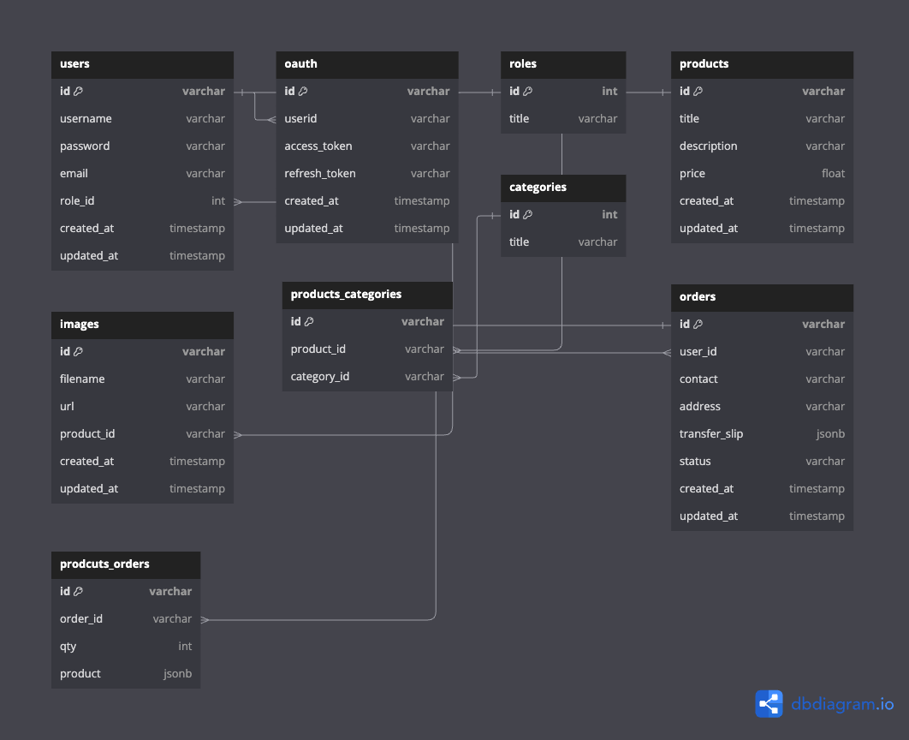

# 🛍️ E-Commerce REST APIs With GO

This is a simple E-Commerce REST APIs project using Golang. This project is built using the following technologies

- Golang (Fiber)
- Docker
- PostgreSQL

## Database Schema

